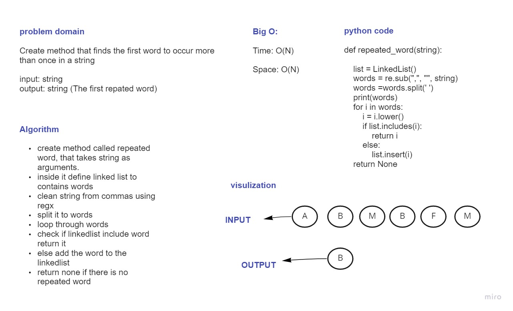

# Challenge Summary
Find the first repeated word in a book.

## Whiteboard Process

## Approach & Efficiency
Time: O(N)

Space: O(N)

## Solution
By giving the method strings that have repeated words, 
the method will clean the string and
split it to words then insert it to the linked list to find the 
first rpeated word and return it. if there is no repeated word it will return none

