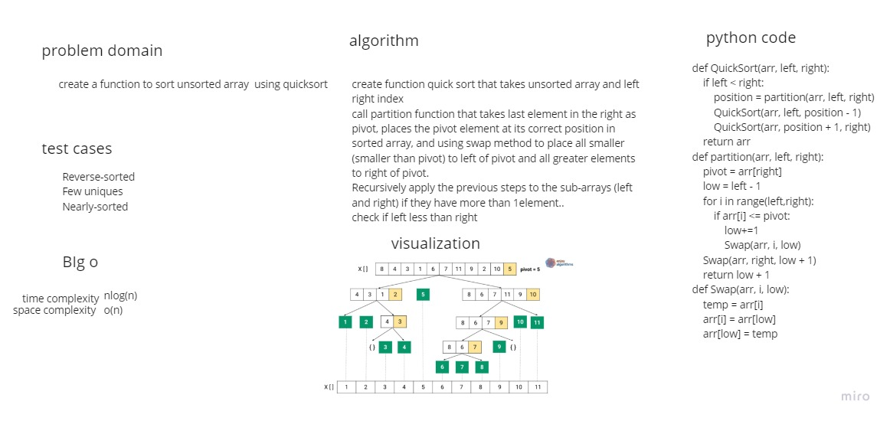

# Challenge Summary
sort am unsorted array using quick sort

## Whiteboard Process

## Approach & Efficiency
time complexity o(nlogn)
space complexity o(n)
## Solution
Specify the pivot (last value in the right), partition the array,and swap values depending if it less or bigger than pivot, continue thorugh the array until each value is sorted.

