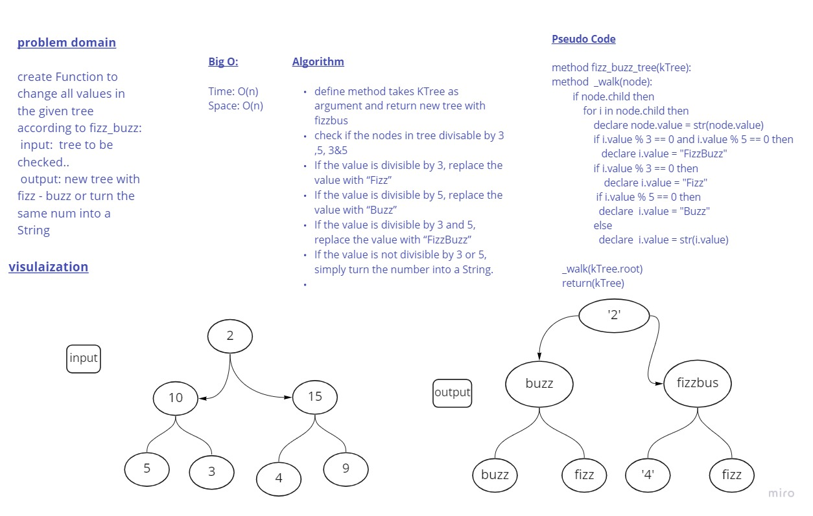

# Challenge Summary
Function to change all values in the given tree according to fizz_buzz:

If the value is divisible by 3, replace the value with “Fizz”

If the value is divisible by 5, replace the value with “Buzz”

If the value is divisible by 3 and 5, replace the value with “FizzBuzz”

If the value is not divisible by 3 or 5, simply turn the number into a String.

## Whiteboard Process

## Approach & Efficiency
time  o(n)
space o(n)

## Solution
define method takes binary tree as 
argument and return new tree with fizzbuz check 
if the nodes in tree dividable by 3 ,5, 3&5
if the value is divisible by 3, replace the value with “Fizz” 
If the value is divisible by 5, replace the value with “Buzz” 
If the value is divisible by 3 and 5, replace the value with “FizzBuzz” If the value is not divisible by 3 or 5, simply turn the number into a String.

